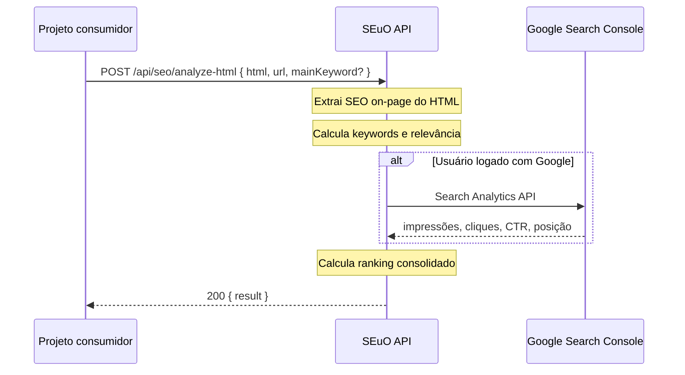

# API — Análise SEO de HTML (`POST /api/seo/analyze-html`)

> Documento de integração para consumo por outro sistema ou por uma I.A. implementadora.  
> Projeto origem: **SEuO SEO** (`Template-Next-Nana`).

---

## 1. Resumo

Este endpoint recebe o **HTML bruto** de uma página, a **URL canônica** da página e, opcionalmente, uma **palavra-chave principal**. Em resposta, retorna um JSON consolidado com:

- Elementos SEO on-page extraídos do HTML
- Palavras-chave relevantes com score de relevância
- Relevância e legibilidade do conteúdo
- Dados de desempenho na SERP via **Google Search Console** (quando o usuário está autenticado)
- **Ranking final** calculado (score 0–100 + tier)

**Implementação no servidor:** `src/app/api/seo/analyze-html/route.ts`  
**Lógica de negócio:** `src/features/seo/services/html-seo-analyzer.ts`

---

## 2. Endpoint

| Campo | Valor |
|-------|-------|
| **Método** | `POST` |
| **Path** | `/api/seo/analyze-html` |
| **Content-Type** | `application/json` |
| **Autenticação** | Opcional (cookie de sessão NextAuth) |
| **Resposta de sucesso** | `200` + `{ "result": HtmlSeoAnalysisResult }` |

### Base URL

Em desenvolvimento:

```
http://localhost:3000/api/seo/analyze-html
```

Em produção, substitua pelo domínio do deploy (ex.: `https://seu-dominio.com/api/seo/analyze-html`).

---

## 3. Request body

### Schema

```json
{
  "html": "string (obrigatório, 1–2.000.000 caracteres)",
  "url": "string (obrigatório, URL http/https válida)",
  "mainKeyword": "string (opcional, máx. 120 caracteres)"
}
```

### Regras de validação

| Campo | Regra |
|-------|-------|
| `html` | Obrigatório. Mínimo 1 caractere. Máximo 2 MB. |
| `url` | Obrigatório. Aceita com ou sem `https://` (o servidor normaliza). Deve ser URL http/https válida. |
| `mainKeyword` | Opcional. Se vazio ou omitido, é ignorado. Aumenta peso dessa keyword na extração. |

### Exemplo mínimo

```json
{
  "html": "<!DOCTYPE html><html lang=\"pt-BR\"><head><title>Guia SEO</title><meta name=\"description\" content=\"Aprenda SEO\" /></head><body><h1>Guia SEO</h1><p>Conteúdo...</p></body></html>",
  "url": "https://seusite.com.br/blog/guia-seo"
}
```

### Exemplo completo

```json
{
  "html": "<!DOCTYPE html>...</html>",
  "url": "https://seusite.com.br/blog/guia-seo",
  "mainKeyword": "guia seo"
}
```

---

## 4. Autenticação e Google Search Console

### Como funciona

O endpoint usa **sessão NextAuth** via cookie HTTP (`getServerSession`). Não há header `Authorization: Bearer` nesta versão.

| Cenário | `searchConsole.connected` | `searchConsole.available` | Dados GSC |
|---------|---------------------------|---------------------------|-----------|
| Sem cookie de sessão | `false` | `false` | Não consulta GSC; análise on-page funciona |
| Logado, sem token Google/GSC | `true` | `false` | Mensagem para reconectar Google |
| Logado com GSC válido | `true` | `true` | Impressões, cliques, CTR, posição, queries |
| URL fora das propriedades GSC | `true` | `false` | Insight explicando que a URL não pertence ao GSC |

### Para obter dados reais do Search Console

O projeto consumidor deve:

1. Fazer login do usuário via **Google OAuth** no projeto SEuO (NextAuth).
2. Garantir escopo OAuth: `https://www.googleapis.com/auth/webmasters.readonly`
3. Enviar o **cookie de sessão** na requisição ao endpoint (`credentials: "include"` no browser ou repasse de cookie em server-to-server).

### Variáveis de ambiente necessárias no servidor SEuO (não no cliente)

```env
GOOGLE_CLIENT_ID=...
GOOGLE_CLIENT_SECRET=...
NEXTAUTH_SECRET=...
NEXTAUTH_URL=https://seu-dominio.com
MONGODB_URI=...   # para persistir tokens OAuth do usuário
```

---

## 5. Resposta de sucesso (`200`)

```json
{
  "result": {
    "analyzedAt": "2026-07-14T18:00:00.000Z",
    "url": "https://seusite.com.br/blog/guia-seo",
    "mainKeyword": "guia seo",
    "onPage": { ... },
    "searchConsole": { ... },
    "ranking": { ... }
  }
}
```

---

## 6. Estrutura detalhada — `result.onPage`

### `onPage.seoScore`

Número `0–100`. Score heurístico de SEO on-page baseado em presença/qualidade de title, meta, H1, conteúdo, schema, imagens com alt, links internos, etc.

### `onPage.elements`

| Campo | Tipo | Descrição |
|-------|------|-----------|
| `title` | `string?` | Conteúdo de `<title>` |
| `metaDescription` | `string?` | Meta description |
| `metaRobots` | `string?` | Meta robots |
| `canonical` | `string?` | URL canônica (`<link rel="canonical">`) |
| `ogTitle` | `string?` | Open Graph title |
| `ogDescription` | `string?` | Open Graph description |
| `lang` | `string?` | Atributo `lang` do `<html>` |
| `h1` | `string[]` | Textos dos H1 |
| `h2` | `string[]` | Textos dos H2 (até 24) |
| `h3` | `string[]` | Textos dos H3 (até 24) |
| `wordCount` | `number` | Palavras no texto visível |
| `imagesTotal` | `number` | Total de `` |
| `imagesWithoutAlt` | `number` | Imagens sem `alt` preenchido |
| `internalLinks` | `number` | Links internos detectados |
| `externalLinks` | `number` | Links externos http(s) |
| `hasTables` | `boolean` | Presença de `<table>` |
| `hasLists` | `boolean` | Presença de `<ul>` ou `<ol>` |
| `hasFaqSection` | `boolean` | FAQ detectado (texto ou schema FAQPage) |
| `hasSchemaMarkup` | `boolean` | JSON-LD ou schema.org |

### `onPage.issues`

`string[]` — lista de problemas detectados (ex.: "Meta description ausente.", "Nenhum H1 encontrado.").

### `onPage.keywords`

Até **15** keywords, ordenadas por relevância:

```json
{
  "keyword": "seo",
  "relevanceScore": 95,
  "occurrences": 12,
  "densityPercent": 1.4,
  "inTitle": true,
  "inH1": true,
  "inMetaDescription": false
}
```

**Algoritmo de relevância (pesos):**

| Origem no HTML | Peso |
|----------------|------|
| `<title>` | 5× |
| `<h1>` | 4× |
| meta description | 3× |
| `<h2>` | 2× |
| `<h3>` | 1,5× |
| corpo do texto | 1× |
| `mainKeyword` informada | +10 bônus |

Stopwords em português e inglês são filtradas.

### `onPage.contentRelevance`

```json
{
  "score": 78,
  "readability": "Média",
  "scannability": "Alta",
  "factors": {
    "wordCount": 70,
    "headingStructure": 90,
    "metaCompleteness": 85,
    "mediaAccessibility": 90,
    "semanticMarkup": 55
  }
}
```

- `readability` / `scannability`: `"Alta"` | `"Média"` | `"Baixa"`
- `factors.*`: sub-scores `0–100` por dimensão

---

## 7. Estrutura detalhada — `result.searchConsole`

```json
{
  "connected": true,
  "available": true,
  "gscProperty": "sc-domain:seusite.com.br",
  "targetUrl": "https://seusite.com.br/blog/guia-seo",
  "mainKeyword": "guia seo",
  "mainKeywordMetrics": {
    "keyword": "guia seo",
    "clicks": 42,
    "impressions": 1200,
    "ctr": 3.5,
    "position": 8
  },
  "topQueries": [
    {
      "keyword": "guia seo",
      "clicks": 42,
      "impressions": 1200,
      "ctr": 3.5,
      "position": 8
    }
  ],
  "totals": {
    "clicks": 156,
    "impressions": 4800,
    "ctr": 3.2,
    "averagePosition": 9
  },
  "positionHistory": [
    { "date": "2026-04-15T00:00:00.000Z", "position": 11 },
    { "date": "2026-07-14T00:00:00.000Z", "position": 8 }
  ],
  "insight": "Bom desempenho orgânico: posição média #9...",
  "checkedAt": "2026-07-14T18:00:00.000Z"
}
```

### Período dos dados GSC

- **Totais e queries:** últimos **28 dias** (com atraso padrão de 3 dias do GSC)
- **positionHistory:** últimos **90 dias** (apenas quando há keyword principal resolvida)

### Quando `available` é `false`

Ainda retorna objeto `searchConsole` com `totals` zerados e `insight` explicativo. A análise on-page **não falha**.

---

## 8. Estrutura detalhada — `result.ranking`

```json
{
  "score": 76,
  "tier": "good",
  "label": "Bom",
  "breakdown": {
    "onPageScore": 72,
    "contentRelevanceScore": 78,
    "serpPerformanceScore": 68
  }
}
```

### Tiers

| `tier` | `label` | Faixa de `score` |
|--------|---------|------------------|
| `excellent` | Excelente | ≥ 80 |
| `good` | Bom | 65–79 |
| `average` | Regular | 45–64 |
| `needs_work` | Precisa melhorar | < 45 |

### Fórmula do ranking consolidado

**Com dados GSC (`serpPerformanceScore` não nulo):**

```
ranking.score = round(onPage × 0.30 + contentRelevance × 0.30 + serpPerformance × 0.40)
```

**Sem dados GSC:**

```
ranking.score = round(onPage × 0.45 + contentRelevance × 0.55)
```

**Cálculo de `serpPerformanceScore` (quando GSC disponível e com impressões):**

```
positionScore = max(0, 100 - averagePosition × 8)
ctrScore      = min(35, ctr × 3.5)
volumeScore   = min(25, log10(impressions + 1) × 10)
serpScore     = min(100, round(positionScore × 0.45 + ctrScore + volumeScore × 0.35))
```

---

## 9. Erros

| HTTP | `error` | Quando |
|------|---------|--------|
| `400` | `INVALID_JSON` | Body não é JSON válido |
| `400` | `VALIDATION_ERROR` | `html`/`url` inválidos ou ausentes |
| `500` | `ANALYSIS_FAILED` | Erro interno na análise |

### Formato de erro

```json
{
  "error": "VALIDATION_ERROR",
  "message": "Informe o HTML do conteúdo."
}
```

---

## 10. Exemplos de integração

### cURL

```bash
curl -X POST "http://localhost:3000/api/seo/analyze-html" \
  -H "Content-Type: application/json" \
  -d '{
    "html": "<html><head><title>Teste</title></head><body><h1>Olá</h1></body></html>",
    "url": "https://seusite.com.br/pagina",
    "mainKeyword": "teste"
  }'
```

Com sessão (cookie):

```bash
curl -X POST "http://localhost:3000/api/seo/analyze-html" \
  -H "Content-Type: application/json" \
  -H "Cookie: next-auth.session-token=SEU_TOKEN" \
  -d '{ "html": "...", "url": "https://seusite.com.br/pagina" }'
```

### JavaScript / TypeScript (browser, mesmo domínio)

```typescript
type AnalyzeHtmlResponse = {
  result?: {
    analyzedAt: string;
    url: string;
    mainKeyword?: string;
    onPage: {
      seoScore: number;
      elements: Record<string, unknown>;
      issues: string[];
      keywords: Array<{
        keyword: string;
        relevanceScore: number;
        occurrences: number;
        densityPercent: number;
        inTitle: boolean;
        inH1: boolean;
        inMetaDescription: boolean;
      }>;
      contentRelevance: {
        score: number;
        readability: "Alta" | "Média" | "Baixa";
        scannability: "Alta" | "Média" | "Baixa";
        factors: Record<string, number>;
      };
    };
    searchConsole: {
      connected: boolean;
      available: boolean;
      totals: {
        clicks: number;
        impressions: number;
        ctr: number;
        averagePosition: number | null;
      };
      topQueries: Array<{
        keyword: string;
        clicks: number;
        impressions: number;
        ctr: number;
        position: number | null;
      }>;
      insight: string;
    };
    ranking: {
      score: number;
      tier: "excellent" | "good" | "average" | "needs_work";
      label: string;
      breakdown: {
        onPageScore: number;
        contentRelevanceScore: number;
        serpPerformanceScore: number | null;
      };
    };
  };
  error?: string;
  message?: string;
};

async function analyzeHtmlSeo(
  html: string,
  url: string,
  mainKeyword?: string,
): Promise<AnalyzeHtmlResponse["result"]> {
  const res = await fetch("/api/seo/analyze-html", {
    method: "POST",
    headers: { "Content-Type": "application/json" },
    credentials: "include",
    body: JSON.stringify({ html, url, mainKeyword: mainKeyword ?? "" }),
  });

  const data = (await res.json()) as AnalyzeHtmlResponse;

  if (!res.ok || !data.result) {
    throw new Error(data.message ?? data.error ?? `HTTP ${res.status}`);
  }

  return data.result;
}
```

### Python (server-to-server, sem cookie)

```python
import requests

response = requests.post(
    "https://seu-dominio.com/api/seo/analyze-html",
    json={
        "html": open("pagina.html").read(),
        "url": "https://seusite.com.br/pagina",
        "mainKeyword": "palavra chave",
    },
    timeout=60,
)
response.raise_for_status()
result = response.json()["result"]
print(result["ranking"]["score"], result["ranking"]["label"])
```

> **Nota:** Sem cookie de sessão, `searchConsole.connected` será `false`. Para GSC em integração server-to-server, seria necessário estender a API (ex.: aceitar token de acesso) — **não suportado nesta versão**.

### Next.js (Server Action / Route Handler no mesmo projeto)

```typescript
import { cookies } from "next/headers";

export async function analyzeFromServer(html: string, url: string) {
  const cookieStore = await cookies();
  const cookieHeader = cookieStore
    .getAll()
    .map((c) => `${c.name}=${c.value}`)
    .join("; ");

  const res = await fetch(`${process.env.NEXT_PUBLIC_APP_URL}/api/seo/analyze-html`, {
    method: "POST",
    headers: {
      "Content-Type": "application/json",
      Cookie: cookieHeader,
    },
    body: JSON.stringify({ html, url }),
  });

  return res.json();
}
```

---

## 11. Fluxo recomendado para o projeto consumidor



### Checklist de integração

- [ ] Obter HTML da página (fetch, CMS, editor WYSIWYG, etc.)
- [ ] Informar `url` correspondente à página publicada (necessária para GSC)
- [ ] Opcionalmente informar `mainKeyword` alvo
- [ ] Enviar `POST` com `Content-Type: application/json`
- [ ] Se precisar de GSC: garantir login Google no SEuO + `credentials: "include"`
- [ ] Tratar `result.onPage.issues` na UI
- [ ] Exibir `result.ranking.score` e `result.ranking.label`
- [ ] Exibir `result.searchConsole` apenas se `available === true`
- [ ] Tratar erros `400` (validação) e `500` (falha interna)

---

## 12. Limitações conhecidas

| Limitação | Detalhe |
|-----------|---------|
| Tamanho do HTML | Máximo 2 MB por requisição |
| Parser HTML | Baseado em regex (não é DOM completo); adequado para HTML típico de CMS |
| GSC só para URL alvo | Concorrentes não são consultados no GSC |
| Auth via cookie | Não há API key nem Bearer token nesta versão |
| Dados GSC do usuário logado | Cada usuário vê apenas propriedades do seu Search Console |
| Idioma | Stopwords e insights em português; HTML em qualquer idioma |

---

## 13. Endpoints relacionados (mesmo projeto)

| Endpoint | Uso |
|----------|-----|
| `GET /api/seo/search-console/page-metrics?url=&keyword=` | Apenas métricas GSC de uma URL (sem análise de HTML) |
| `GET /api/seo/search-console/status` | Status de conexão GSC do usuário logado |
| `POST /api/seo/analyze` | Análise comparativa por URLs (busca HTML automaticamente) |
| `POST /api/seo/google-position-check` | Position checker URL + keyword |

---

## 14. TypeScript — tipos de referência

Arquivos no repositório origem:

- Request: `src/features/seo/schemas/html-seo-analysis-input.ts`
- Response: `src/features/seo/types/html-seo-analysis.ts`
- GSC nested type: `src/features/seo/types/analysis.ts` → `ComparativeSearchConsoleData`

---

## 15. Perguntas frequentes para implementadores

**P: Posso enviar só um fragmento HTML (sem `<html>`)?**  
R: Sim, mas a extração será limitada (sem `<title>`, meta, etc. se não estiverem no fragmento).

**P: A `url` precisa ser a mesma do HTML?**  
R: Recomendado. É usada para GSC, contagem de links internos e canonicalização.

**P: O endpoint busca a URL automaticamente?**  
R: **Não.** O HTML deve ser enviado no body. A `url` serve para GSC e contexto.

**P: Como testar GSC localmente?**  
R: Login Google em `http://localhost:3000/login`, depois chamar o endpoint com `credentials: "include"`. Configure `GOOGLE_CLIENT_ID`, `GOOGLE_CLIENT_SECRET`, `NEXTAUTH_URL`, `NEXTAUTH_SECRET`.

**P: O ranking muda se não houver GSC?**  
R: Sim. Sem GSC, o peso é 45% on-page + 55% conteúdo (sem componente SERP).

---

*Última atualização: julho/2026 — alinhado ao código em `src/app/api/seo/analyze-html/route.ts`.*
